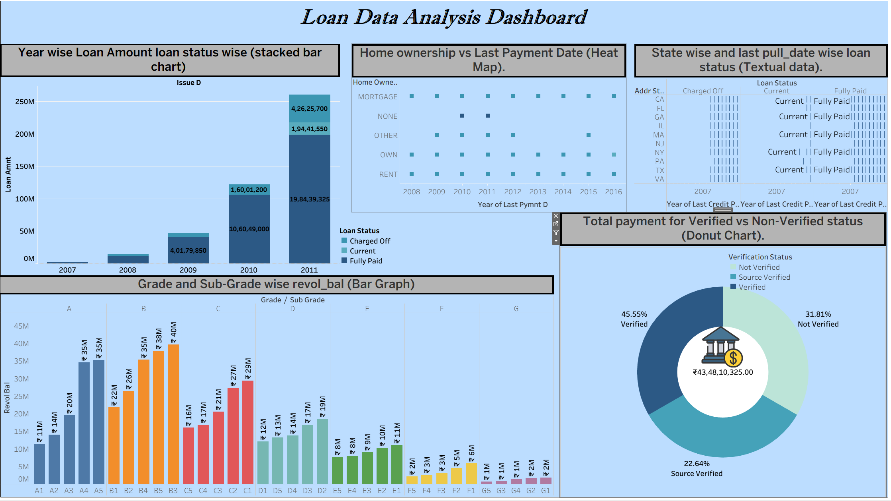

# Loan-Data-Analysis-Dashboard

# 📊 Loan Data Analysis Dashboard

This repository contains a Tableau dashboard designed to analyze loan dataset trends based on loan status, verification status, borrower information, and payment behavior.  
The dashboard helps stakeholders understand risk patterns, borrower characteristics, and repayment trends using multiple analytical visualizations.

## 🚀 Dashboard Overview

The Loan Data Analysis Dashboard provides insights using the following key visualizations:

| Visualization | Description |
|--------------|-------------|
| **Year-wise Loan Amount by Loan Status (Stacked Bar Chart)** | Displays how loan amounts evolved over time (2007–2011) and how loans fall under different statuses such as Charged Off, Current, Fully Paid, etc. |
| **Grade & Sub-Grade wise Revolving Balance (Bar Chart)** | Shows how loan revolving balances vary across loan grades (A–G) and their sub-levels. |
| **Home Ownership vs Last Payment Date (Heatmap)** | Identifies repayment patterns based on borrower homeownership categories like Mortgage, Rent, Own, etc. |
| **State-wise & Last Credit Pull Date Loan Status (Table)** | Compares geographic distribution of loans and latest borrower credit checks. |
| **Verified vs Non-Verified Total Payment (Donut Chart)** | Highlights how verification status impacts total payment contribution. |

---

## 🧾 Dataset Summary

The dashboard uses loan-related metadata such as:

- Loan amount
- Borrower grade & subgrade
- Loan status (Charged Off, Fully Paid, Current, etc.)
- Verification status
- Revolving balance (`revol_bal`)
- Geographic & demographic borrower factors
- Payment history dates

> *(Dataset fields may vary depending on the source file used.)*

---

## 🛠 Tools & Technologies

| Technology | Purpose |
|-----------|---------|
| **Tableau Public / Tableau Desktop** | Interactive dashboard creation |
| **Loan Dataset (CSV/Excel)** | Source data for visualization |

---

---

## 📈 Insights Observed

✔ Loan issuance increased significantly between **2009–2011**  
✔ Verified borrowers contribute more to successful repayment  
✔ Loan performance varies by grade and geographic region  
✔ Homeownership influences repayment consistency  

